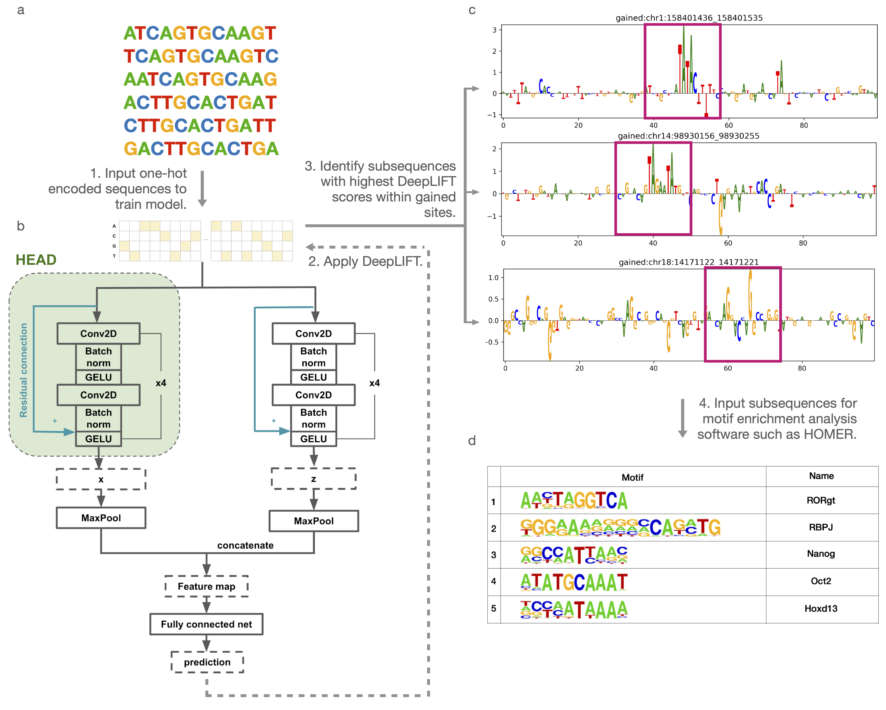

# DARDN (DnAResDualNet): Identifying transcription factors inducing cancer-specific CTCF binding using multi-CNNs and DeepLIFT
### Getting started
#### 1. Clone the repository using the following command:
```bash
git@github.com:berkuva/DARDN.git
```
#### 2. Download the "union_binding_occupancy_score_GT3.csv" file using the following `wget` command:
```bash
wget https://zanglab.github.io/data/cancerCTCF/data/union_binding.bed
```
For other chromosomes, you can use `generate_onehot.py` to one-hot encoded generate T-ALL gained CTCF sites.
#### 3. Download T-ALL gained and constitutive CTCF sites for chromosome 1 `chr1_len5045.npz` from [Google Drive](https://drive.google.com/file/d/1OVzRNC-hGlhHBC90V62-6Hf6G3Jx5ytP/view?usp=sharing).
This file contains 26009 CTCF-centered sites, each with length 10090.
#### 4. Run DARDN on the sample data and pre-set parameters:
`python run_model.py`

Otherwise, modify `load_data.py` as needed to load the desired input data to train DARDN. To modify subsequence selection from gained CTCF sites, modify parameters in `extract_subsequences.py`.


# DARDN (DnAResDualNet)
<div align="center">
    
</div>

DARDN is a deep learning framework for identifying transcription factors bound near cancer-specific CTCF sites. DARDN is a product of an extension of a [previous study](https://genomebiology.biomedcentral.com/articles/10.1186/s13059-020-02152-7).


## Results
We ran DARDN on T-cell acute lymphoblastic leukemia (T-ALL) data and identified RBPJ as one of the most enriched motifs under various perturbations to show the robustness of our pipeline.

<div align="center">
 
</div>

DARDN is cancer-type agnostic and can easily be adapted to other cancer types. We show the adaptability by running our pipeline on 5 additional cancer types: acute myeloid leukemia (AML), breast cancer (BRCA), colorectal cancer (CRC), lung adenocarcinoma (LUAD), and prostate cancer (PRAD). Please find detailed tables and figures in our [manuscript]().


### Pipeline
1. Prepare CTCF-centered DNA sequences.
2. Perform data augmentation if necessary.
3. Train and evaluate DARDN, which contains dual-CNN networks and residual connections.
4. Apply [DeepLIFT](https://arxiv.org/abs/1704.02685) to gained sites to assign scores to subsequences. 
5. Select subsequences with high DeepLIFT scores (above a cutoff score or a fixed number of subsequences) and input them into a motif analysis tool such as [HOMER](http://homer.ucsd.edu/homer/).


#### 1. Prepare CTCF-centered DNA sequences
If you don't have your own CTCF-centered data and would like to use the data used in our work, you can download cancer-specific CTCF gained sites [here](https://zanglab.github.io/data/cancerCTCF/#download). This link includes CTCF gained sites for T-ALL, AML, BRCA, CRC, LUAD, and PRAD as well as constitutive CTCF sites. Additionally, you can generate CTCF-centered data by using the provided generate_onehot.py

#### 2. Data Augmentation
Augmenting DNA sequences can include shifting and reverse complementation of the original sequences. utils.py contains functions for data augmentation. Please modify them as necessary.

#### 3. Train and evaluate DARDN
You can run run_model.py to train and evaluate DARDN. We also provide pre-trained weights in pretrained_weights.pth

#### 4. Apply DeepLIFT
extract_subsequences.py contains two methods to select subsequences after DARDN is trained: 1. Select a fixed number (say 10) of subsequences from each gained sequence. 2. Select a fixed number (say 10) of subsequences from each gained sequence. We also provided attributions.pt which contains DeepLIFT calculations for each gained site for T-ALL.

#### 5. Run motif analysis software such as HOMER
Sample HOMER command:
findMotifsGenome.pl /path/to/subsequences.txt hg38 /path/to/save_dir/ -size 200

### Summary
- Run generate_onehot.py to generate sequences.
- Run run_model.py for model training and DeepLIFT calculations. Or, use provided pre-trained parameters (pretrained_weights.pth) and DeepLIFT scores for each gained site in T-ALL (attributions.pt).
- Run extract_subsequences.py to filter subsequences with the most positive DeepLIFT scores. This creates a txt file with the genomic coordinates of the selected subsequences. - Run motif analysis.

## Citation
If you use any data from this website, please cite:

